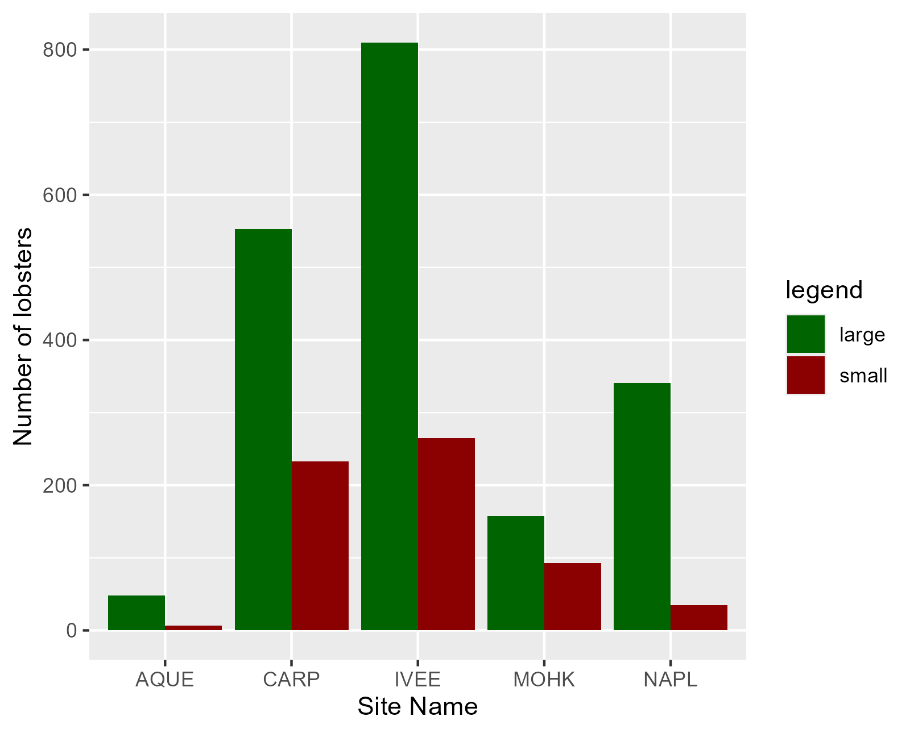
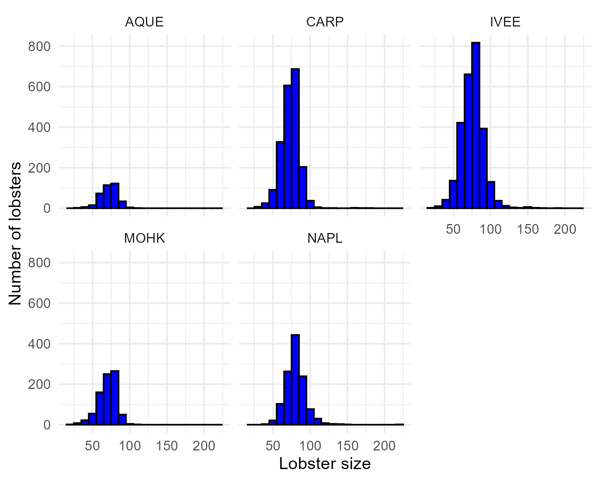
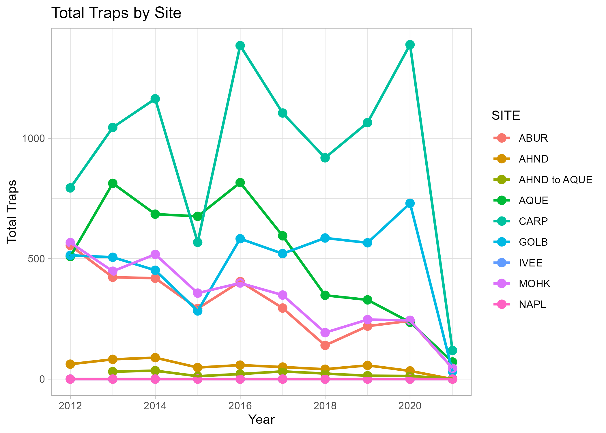
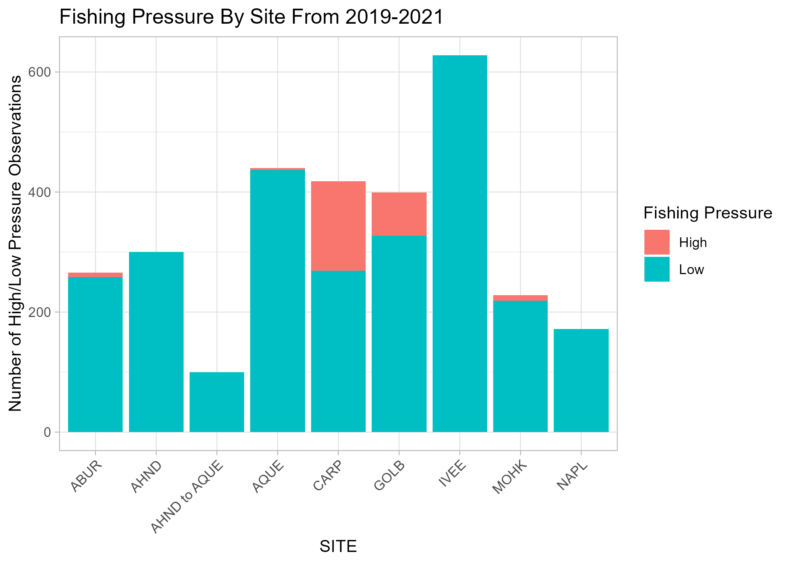

## Analysis of Lobster Population and Fishing Pressure

### Citation

Santa Barbara Coastal LTER, D. Reed, and R. Miller. 2022. SBC LTER: Reef: Abundance, size and fishing effort for California Spiny Lobster (Panulirus interruptus), ongoing since 2012 ver 8. Environmental Data Initiative. https://doi.org/10.6073/pasta/25aa371650a671bafad64dd25a39ee18 (Accessed 2026-04-16).

### Abstract Summary

This data set contains information that relates to California spiny lobster abundance, size, and fishing pressure on the coast of the Santa Barbara Channel. Abundance data was collected by divers while fishing pressure data was determined by data from trap floats set up along the mainland.

### Data

### Lobster Abundance Analysis
::: {#fig-lobster-abundance layout-ncol="2"}
{fig-alt="A bar graph that shows the abundance of lobsters relative to the sites sampled" fig-align="left" width="288"}

{fig-alt="A collection of histograms to show distribution of lobster abundance across 5 different sites" fig-align="left" width="295"}
:::
### Lobster Fishing Pressure Analysis

::: {layout-ncol="2"}
{fig-align="left" width="288"}

<<<<<<< HEAD
{fig-align="left" width="295"}
:::
=======
### Discussion

For the lobster abundance data, the site "IVEE" had the largest lobsters while also having the most abundance across all sites. The "AQUE" site had the least amount of lobsters overall.

